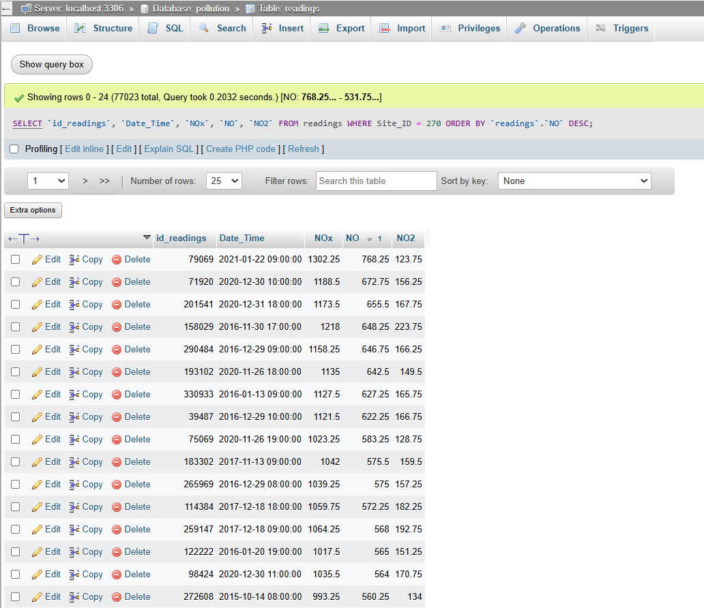

# Component 6: Model, Implement and Query a Selected NoSQL Database

This report will explore the creation of a basic NoSQL data model, using the 'pollution' dataset. My choice of database software is BaseX; chosen due to its relative ease of use and the need to develop

## Creating the database sample

I started by selecting Wells Road at random, before viewing the readings data in PHPMyAdmin. I then created the following SQL query:

The first issue here are the large proportion of null values. The pattern seen in the above image was repeated across the dataset for Wells Road. Therefore, I refined my query to include the following columns: id_readings, Date_Time, NOx, NO and NO2. There was no point in having columns with only null values in them, so they were removed for efficiency and readability of the end product. The query was then amended to return a dataset organised from the highest recorded levels of nitric oxide.

### Importing a sample of the data

Next, I used PHPMyAdmin's export feature to pipe through the first 25 rows, sending it through into BaseX. 

While the sample has been successfully imported into BaseX, we have a problem with its structure which can be seen in the image below:

The current structure does not contain any nesting, which essentially means that a key advantage of using an XML database is not currently being utilised. At first, I considered manually creating the desired nested structure for ten entries. However, this has little to no real-world application, since one cannot reasonably expect to manually put together an XML document for larger files. Even doing it for ten felt like a chore!

The image above shows the structure that I am intending to create in NoSQL form. Essentially, I want to give the three readings in each cell their own nest, separating them from the Date_Time and reading_id values. This format evolved as I went through the process of creating piped data that would follow a more readable and usable format.

#### Using XSLT Stylesheet

My main breakthrough in this section of the assignment was learning basic XSLT. I used the w3schools tutorial, in combination with the notes in Workshop 10. I learnt that I could create a stylesheet, which can be used to transform XML documents to match a desired format or schema (https://www.w3schools.com/xml/xsl_intro.asp). The end result of this is below:

First, I used the template function and matched it with the pollution database. Next, I added the first root element. This was actually a step I did not do until the third implementation of this code, when I tried to convert the XML file using it and it was rejected. It did this since there was no accepted root element, so the one beneath had been assigned this instead.

Next, I used the for-each function to commence an iterable loop. For this example, I entered the five key columns as stated above. Using the value-of function for each, I was able to populate my new XML file with all the required data values. It was important to keep the first root element out of this loop, so that it only showed up at the very beginning and the very end of the XML file.

While I am sure there were ways to use further programming skills to get my XML file to be converted to the structure made in the stylesheet, I relented and used a free online XSL transformer (https://freeformatter.com/xsl-transformer.html). This is where, had I more time, I would have liked to learn how to use Python to complete this transformation instead.

The main advantage with this format is the introduction of a hierarchical structure through parent and child nodes (https://www.w3schools.com/xml/xpath_nodes.asp). This is demonstrated in the placement of the NO, NOx and NO2 elements, which are nested in the nitrogen_readings element, resulting in a more intuitive format that is easily readable. Each chunk of reading data has its own ID, which helps with database normalisation. There are also no duplicate data entries when using this format. Although this is only a small sample of data, BaseX would be a good fit for the whole dataset since it is designed for horizontal scalability (https://www.geeksforgeeks.org/what-are-the-advantages-and-disadvantages-of-using-sql-vs-nosql-databases/#advantages-and-disadvantages-of-nosql-databases). 

##### Queries

Now that the data has been successfully converted into an XML format, it is time to run some queries. 

]

###### References

